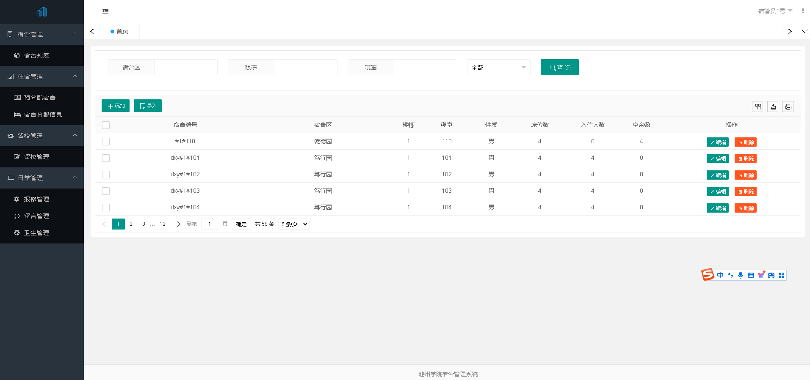

# 宿舍管理系统-02

毕业设计：主题“宿舍管理系统-02”

基于Mysql、SpringBoot，前端使用：Thymeleaf、LayUI

项目完整代码已上传，包含必要代码备注。

数据库私聊获取：

email：xiehdwork@163.com

wx:15349843018

##### 项目部署+指导；论文指导；答辩一对一细节指导......

#### 项目部分截图：

1. 登录页：

2. 学生端

3. 教师端

4. 宿管员端

